

  <a href="https://SheharyarXD.github.io/interactive-core" target="_blank">
    
  </a>

  <b>SYSTEM.STATUS</b> [ ONLINE ] ⎔ <b>CORE</b> [ ACTIVE ] ⎔ <b>AI PIPELINE</b> [ RUNNING ]

 

<!-- ================================================================= -->
<!-- 01 // SYSTEM SPECIFICATION & ARCHITECTURAL IDENTITY               -->
<!-- ================================================================= -->

  

 

<!-- ================================================================= -->
<!-- 02 // TECHNOLOGY SYSTEM MATRIX                                    -->
<!-- ================================================================= -->

  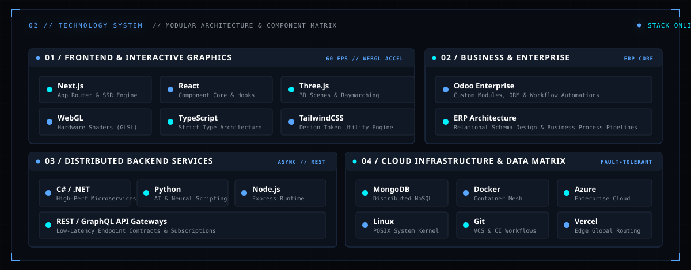

 

<!-- ================================================================= -->
<!-- 03 // DEVELOPER TELEMETRY                                         -->
<!-- ================================================================= -->

  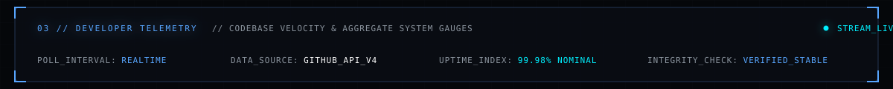

  <a href="https://github.com/SheharyarXD" target="_blank">
    
  </a>
  <a href="https://github.com/SheharyarXD" target="_blank">
    
  </a>

  

 

<!-- ================================================================= -->
<!-- 04 // CONTRIBUTION NETWORK (ACTIVITY OSCILLOSCOPE)                -->
<!-- ================================================================= -->

  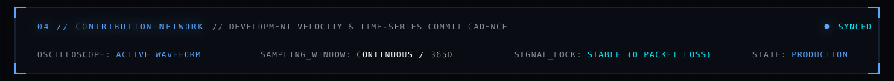

  <a href="https://github.com/SheharyarXD" target="_blank">
    
  </a>

 

<!-- ================================================================= -->
<!-- 05 // FEATURED ARCHITECTURE (PORTFOLIO SHOWCASE)                  -->
<!-- ================================================================= -->

  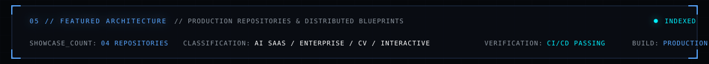

 

<!-- 01: LEAD-FLOW-AI (AI SAAS) -->

  <a href="https://github.com/SheharyarXD/Lead-Flow-AI" target="_blank">
    
  </a>

 

<!-- 02: COLL-PRO (ENTERPRISE WORKFLOW SAAS) -->

  <a href="https://github.com/SheharyarXD/Coll-Pro" target="_blank">
    
  </a>

 

<!-- 03: WEAPON-DETECTOR (COMPUTER VISION & DEEP LEARNING) -->

  <a href="https://github.com/SheharyarXD/Weapon-Detector" target="_blank">
    
  </a>

 

<!-- 04: CS2-GAME-WEB (FLAGSHIP INTERACTIVE WEB EXPERIENCE) -->

  <a href="https://github.com/SheharyarXD/CS2-Game-Web" target="_blank">
    
  </a>

 

<!-- ================================================================= -->
<!-- 06 // COMMS & SECURE PROTOCOL DISPATCH TERMINAL                   -->
<!-- ================================================================= -->

  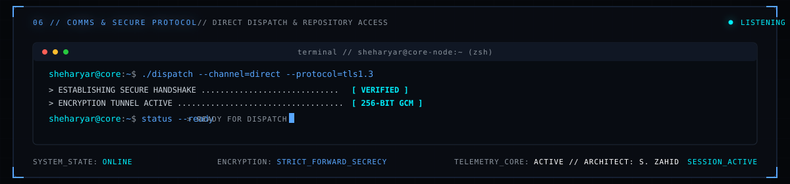

 

  <a href="mailto:your-email@example.com">
    <code>[ INITIATE_CONTACT ]</code>
  </a>
  &nbsp;&nbsp;⎔&nbsp;&nbsp;
  <a href="https://SheharyarXD.github.io/interactive-core" target="_blank">
    <code>[ VIEW_FULL_TERMINAL ]</code>
  </a>
  &nbsp;&nbsp;⎔&nbsp;&nbsp;
  <a href="https://github.com/SheharyarXD?tab=repositories" target="_blank">
    <code>[ EXPLORE_ALL_REPOSITORIES ]</code>
  </a>

 

  <b>SESSION.STATE</b> [ AUTHENTICATED ] ⎔ <b>ENCRYPTION</b> [ 256-BIT_GCM ] ⎔ <b>ARCHITECT</b> [ SHEHARYAR ZAHID ] ⎔ <b>CORE_KERNEL</b> [ v4.2_ONLINE ]

